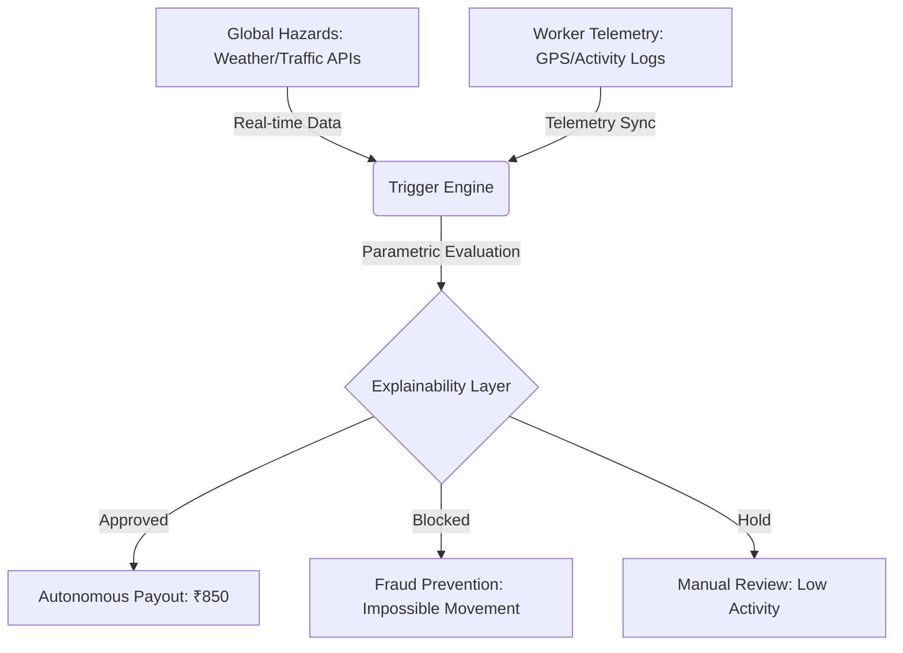

# 🛡️ GigShield AI 

### **Autonomous Parametric Income Protection for the Global Gig Economy**


[](https://opensource.org/licenses/MIT)
[](https://huggingface.co/spaces/LegendOP4/gigshield-demo)
[](https://github.com/legendop4/GigShield)

---

## 🌍 The Vision: "Insurance Without the Forms"
Every day, over **500 million gig workers** worldwide face a critical vulnerability: **Direct Income Loss.** When a heatwave strikes 45°C in Delhi, or a sudden flash flood hits Mumbai, delivery partners lose their daily bread—not because they can't work, but because the environment makes it physically impossible or dangerous.

Legacy insurance is too slow, too manual, and for a $5 delivery, too expensive.

**GigShield is different.** We don't wait for claims. We listen to the world. By syncing real-time **Hazard Markers** (Weather, Traffic, Pollution) with **Worker Telemetry**, we trigger **Instant, Autonomous Payouts** the moment a threshold is hit.

---

## 🧠 Technical Architecture: The Monolith Orchestrator
To achieve a **zero-cost, high-performance** production deployment, GigShield utilizes a unified **Container Monolith** strategy.



### **Core Stack**
- **Frontend:** React + Tailwind CSS (Optimized for Mobile-First Workers)
- **Backend Orchestrator:** Node.js + Express
- **The "Brain":** Autonomous Trigger Engine (Cron-based Parameter Evaluation)
- **Database:** MongoDB Atlas (M0 Global Cluster)
- **Deployment:** Unified Monolith on Hugging Face Spaces (via Nginx & Supervisord)

---

## 🎭 Demonstrating Trust (The Investor Personas)
We have pre-seeded the environment with three clear personas to demonstrate how GigShield handles the spectrum of gig work behavior.

| Persona | Status | The Story |
| :--- | :--- | :--- |
| **Shivam (Perfect Pilot)** | **Approved** | 99% track record. ₹5,400+ in historical payouts. Consistent GPS telemetry and high delivery volume. |
| **Risk Node** | **Monitoring** | Worker in a high-hazard zone (Simulation: Heavy Rain). System is actively tracking for recovery trigger. |
| **Fraudulent Actor** | **Blocked** | **Zero-Claim Success:** System detected "Delhi to Mumbai in 5 minutes" movement. Payout killed instantly. |

---

## 🕹️ Live Interactive Demo
Our **Investor Console** allows you to see the "Brain" of the project in real-time.

1. **Access the Console:** [legendop4-gigshield-demo.hf.space/demo-console](https://legendop4-gigshield-demo.hf.space/demo-console)
2. **Step 1: Environmental Reset:** Wipe the state and initialize the deterministic personas.
3. **Step 2: Hazard Injection:** Simulate a "Heavy Rain" crisis across all nodes.
4. **Step 3: Execution Inference:** Fire the engine and watch the **Explainability Matrix** approve Shivam while blocking the Fraudster.

---

## 🛠️ Quick Start (Local Setup)

1. **Clone the Repo:**
   ```bash
   git clone https://github.com/legendop4/GigShield
   cd GigShield
   ```
2. **Install Dependencies:**
   ```bash
   npm install
   ```
3. **Run Locally:**
   ```bash
   npm run dev
   ```

---

## 🛡️ GigShield AI: Protecting the Global Gig Economy, One Parameter at a Time.
**[Join the Mission](https://github.com/legendop4/GigShield)** | **[View Documentation](https://huggingface.co/spaces/LegendOP4/gigshield-demo)** | **[Pitch Kit](https://github.com/legendop4/GigShield/blob/main/docs/investor_pitch_kit.md)**
